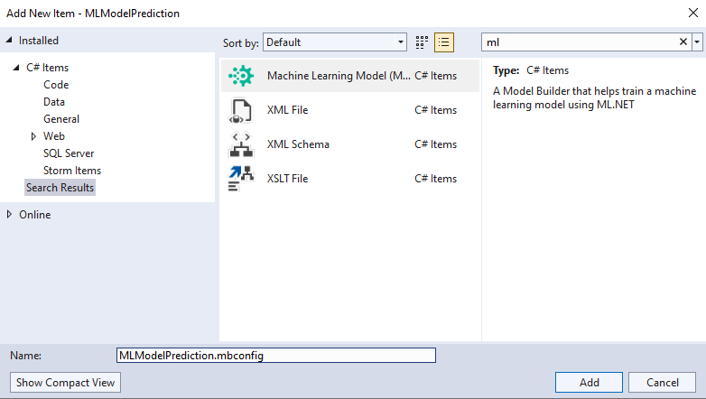

## Links

Link to YouTube Training
https://www.youtube.com/watch?v=vISLS8aY0RU&list=PLdo4fOcmZ0oW_k4_eDTPWDLUVWz7A9y0M&index=1

Link to examples

https://learn.microsoft.com/en-us/dotnet/machine-learning/automate-training-with-model-builder#data

## How to add models setting extention

How to add model extention

WebApi

http://localhost:52291/swagger/index.html
